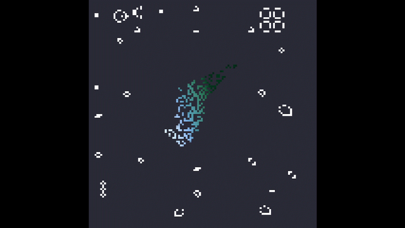

# Lab 2: Conway’s Game Of Life

Implementación del algoritmo de
**Conway's Game of Life** en Rust usando `raylib`, con un framebuffer
propio y un estado inicial creativo basado en el logo de *Final Fantasy VII*.



## Descripción

El proyecto renderiza en tiempo real la evolución de un autómata celular
siguiendo las reglas clásicas de Conway, dibujando cada celda directamente
sobre un framebuffer propio (sin usar las primitivas de dibujo de alto
nivel de raylib para las celdas, solo para mostrar la textura final en
pantalla).

El estado inicial combina dos cosas:

- **El logo del meteoro de FF7**, convertido de un PNG a un patrón de
  celdas vivas mediante umbralización por luminancia, conservando su
  degradado de colores original (azul → turquesa → blanco) en el primer
  frame.
- **Organismos clásicos de Life** (spaceships, osciladores y still lifes)
  distribuidos alrededor del logo, para que la mecánica real del juego
  sea evidente desde el primer momento.

## Reglas implementadas

Para cada celda, en cada generación:

1. Una célula viva con menos de 2 vecinos vivos muere (subpoblación).
2. Una célula viva con 2 o 3 vecinos vivos sobrevive.
3. Una célula viva con más de 3 vecinos vivos muere (sobrepoblación).
4. Una célula muerta con exactamente 3 vecinos vivos nace (reproducción).

El conteo de vecinos usa **wraparound toroidal** (los bordes del tablero
se conectan con el lado opuesto).

## Organismos incluidos en el estado inicial

| Categoría | Organismos |
|---|---|
| Still lifes | Block, Beehive, Loaf, Boat, Tub |
| Osciladores | Blinker, Toad, Beacon, Pulsar, Pentadecathlon |
| Spaceships | Glider, LWSS, MWSS, HWSS |
| Generador | Gosper Glider Gun |

Todos posicionados con separación suficiente entre sí y respecto al logo
central, para que cada uno se pueda apreciar individualmente al arrancar
la simulación.

## Estructura del proyecto

```
.
├── README.md       # Descripción del proyecto, controles y notas
├── preview.gif     # Vista previa animada del resultado
├── Cargo.toml      # Dependencias y configuración del crate
├── Cargo.lock      # Versiones fijadas de dependencias
├── assets/
│   └── ff7_logo.png    # Imagen fuente del logo del meteoro
src/
├── main.rs         # Loop principal, construcción del estado inicial, input
├── framebuffer.rs  # Buffer de pixeles propio (Image de raylib) y render a ventana
├── life.rs         # Struct Grid: estado, colores, vecinos, step()
├── line.rs         # Algoritmo de Bresenham para dibujo de líneas
├── logo.rs         # Carga del PNG del logo, color y muestreo del patrón inicial
└── patterns.rs     # Coordenadas de los organismos clásicos de Life
```

## Controles

| Tecla | Acción |
|---|---|
| `Espacio` | Pausar / reanudar la simulación |
| `R` | Reiniciar al estado inicial |
| `→` (flecha derecha) | Avanzar una generación manualmente (mientras está en pausa) |
| `O` | Ocultar / mostrar el contador visible en pantalla |

## Cómo correrlo

Requiere Rust y las dependencias de sistema de `raylib-rs` instaladas.

```bash
git clone https://github.com/MarceloDetlefsen/lab2-graficas.git
cd lab2-graficas
cargo run
```

## Dependencias principales

- [`raylib`](https://crates.io/crates/raylib) — ventana, input y render de texturas.
- [`image`](https://crates.io/crates/image) — carga y redimensionado del PNG del logo.

## Notas de diseño

- El framebuffer lógico corre a una resolución baja (120x120) y se
  escala hacia arriba al dibujarse en la ventana (900x900), para que
  cada celda ocupe varios píxeles en pantalla y el patrón se aprecie
  con claridad.
- El color de las celdas nacidas del logo se hereda por promedio de los
  colores de los vecinos que las hicieron nacer, así el degradado
  original del logo se "contagia" al resto del tablero a medida que
  evoluciona, en vez de perderse en blanco plano.
- El estado inicial es una condición de arranque, no un patrón estable:
  se espera que el logo se disuelva y de paso a nuevas formas conforme
  avanzan las generaciones, mientras los spaceships (glider, LWSS, MWSS,
  HWSS, glider gun) siguen viajando por el tablero de forma predecible.

## Autor

Marcelo Detlefsen - 24554 
